# EJA M v1.0

  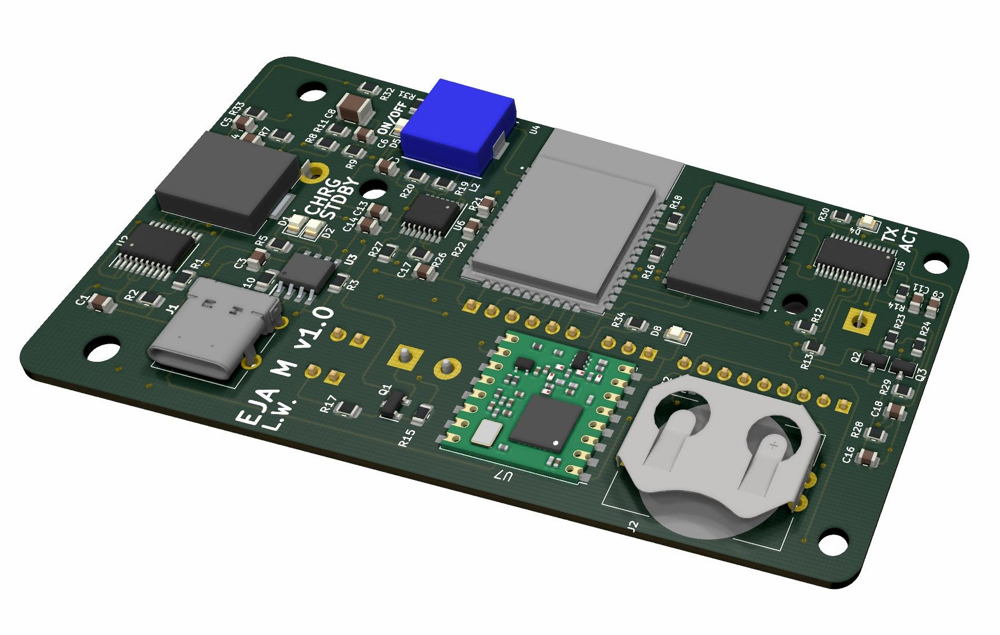

The new EJA M v1.0 is an upgrade/replacement of my older PCB designs: [Buoy A v1.0](https://github.com/leonardoward/eja-intelligent-buoy-a-electronics), [Buoy B v1.0](https://github.com/leonardoward/eja-intelligent-buoy-b-electronics), and [Onboard Gateway v1.0](https://github.com/leonardoward/eja-onboard-gateway-electronics). The design includes the following features:

- USB C Port with Electromagnetic Compatibility (EMC)
- FTDI (FT260S-U) with an Auto Reset Circuit for the ESP32
- ESP32
- GPS Module
- LoRa Transceiver
- Real-time Clock (RTC)
- Connector for a Servo Motor
- 5V 2A Stepup (for the Servo Motor)
- 3.3V Battery Charging Circuit
- Connector for a 3 axis accelerometer
- Circuit to measure the battery level
- 3.3V 3A SEPIC Converter
- On-OFF circuit for a Button
- Access to unused pins in the ESP32

This repository contains the Kicad project (including Gerber files) and a more detailed description about the implementation of the different features in the design.

## Table of Contents

1. [Hardware Design](#getting-started)
    1. [USB C Port with Electromagnetic Compatibility EMC](#usb-c-port-with-electromagnetic-compatibility-emc)
    2. [FTDI FT260S](#ftdi-ft260s)
    3. [Auto Reset Circuit for the ESP32](#auto-reset-circuit-for-the-esp32)
    4. [ESP32](#esp32)
    5. [GPS](#gps)
    6. [LoRa](#lora)
    7. [Real time Clock RTC](#real-time-clock-rtc)
    8. [Servo Motor Connector](#servo-motor-connector)
    9. [5V 2A Stepup](#5v-2a-stepup)
    10. [Accelerometer Connector](#accelerometer-connector)
    11. [Battery Charging Circuit](#battery-charging-circuit)
    12. [Battery Level](#battery-level)
    13. [3V3 3A SEPIC Converter](#3v3-3a-sepic-converter)
    14. [ON-OFF Led](#on-off-led)
    15. [ON-OFF Button Circuit](#on-off-button-circuit)
    16. [Extra Header](#extra-header)
2. [PCB Dimensions and Boundaries](#pcb-dimensions-and-boundaries)
3. [3D Model](#3d-model)
4. [Bill of Materials](#bill-of-materials)
    1. [PCB Components](#pcb-components)
    2. [Externals Components](#externals-components)

## Hardware Design

### USB C Port with Electromagnetic Compatibility EMC

Everything starts with the USB C port, we have chosen this type of USB because it's size and because of the growing trend of using this port to charge and communicate with portable devices.

We have included [Transient Voltage Suppression (TVS) diodes](https://www.digikey.com/en/products/detail/comchip-technology/CPDT6-5V4-HF/1121118) and [Ferrite Beads](https://www.digikey.com/en/products/detail/fair-rite-products-corp/2508056017Y0/8594301) to reduce the Electromagnetic Interference (EMI). These [protections for the USB port](https://www.rs-online.com/designspark/usb-port-protection) will add compliance with the [EMC regulations and standards](https://learnemc.com/emc-regulations-and-standards) from the  Federal Communications Commission (FCC) and the European Union.   

  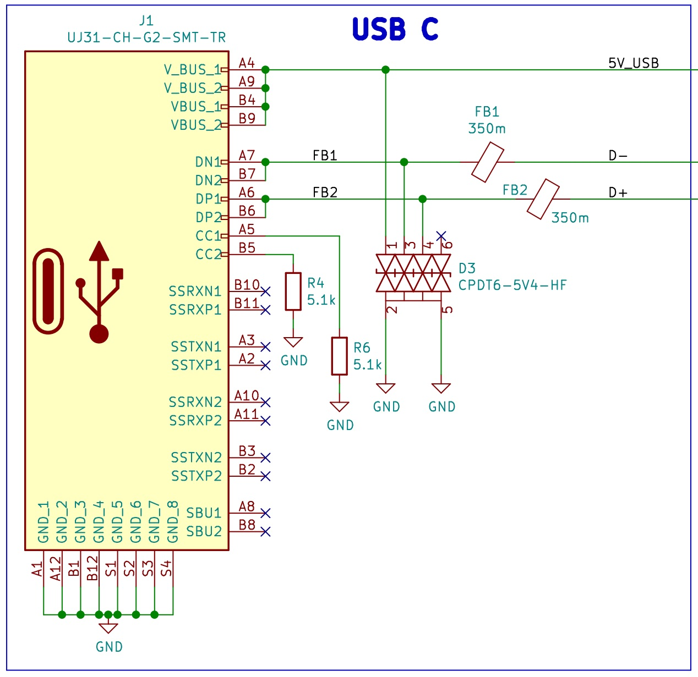

**[Back to top](#table-of-contents)**

### FTDI FT260S

The design includes the [FT260S-U](https://www.digikey.com/en/products/detail/ftdi-future-technology-devices-international-ltd/FT260S-U/6124909), a USB TO UART/I2C FTDI that will be used to program the ESP32.

  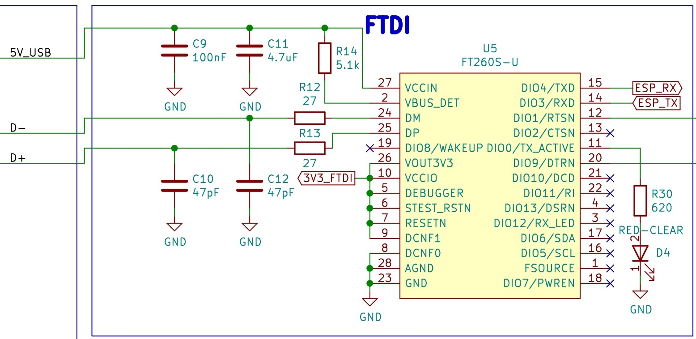

**[Back to top](#table-of-contents)**

### Auto Reset Circuit for the ESP32

The design includes an auto reset circuit that uses RTS and DTR to reset and put in bootloader mode the [ESP32](https://www.digikey.com/en/products/detail/espressif-systems/ESP32-WROOM-32D-4MB/9381716). For more information about this circuit, these blogs [(1)](https://forum.micropython.org/viewtopic.php?f=18&t=4966) [(2)](https://forums.adafruit.com/viewtopic.php?f=57&p=483993#p487891) can be useful.

  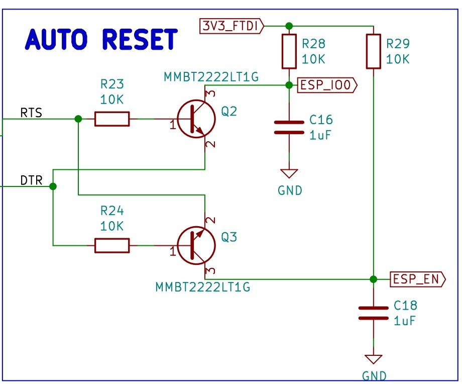

**[Back to top](#table-of-contents)**

### ESP32

The main microcontroller in the PCB is the [ESP32](https://www.digikey.com/en/products/detail/espressif-systems/ESP32-WROOM-32D-4MB/9381716), the following image shows the signals dedicated to the different pins. The ESP32 is connected to the [FTDI](https://www.digikey.com/en/products/detail/ftdi-future-technology-devices-international-ltd/FT260S-U/6124909), a [GPS](https://lcsc.com/product-detail/Satellite-Positioning-Modules_ZHONGKEWEI-ATGM332D-5N31_C128659.html), a [LoRa transceiver](https://www.digikey.com/en/products/detail/rf-solutions/RFM95W-915S2/6564923), a connector for a servo motor, a [real-time clock](https://www.digikey.com/en/products/detail/maxim-integrated/DS3231M-TRL/2402421?s=N4IgTCBcDaICIGUDMYkEYCyBqAKgJQBkBhHAWgDk4QBdAXyA), a circuit to measure the battery level, a connector for an [accelerometer](https://www.digikey.com/en/products/detail/adafruit-industries-llc/4097/9951931?s=N4IgTCBcDaIIwFYwA4C0KDsAWVA5AIiALoC%2BQA), and a few headers to provide access for the unused peripherals.

  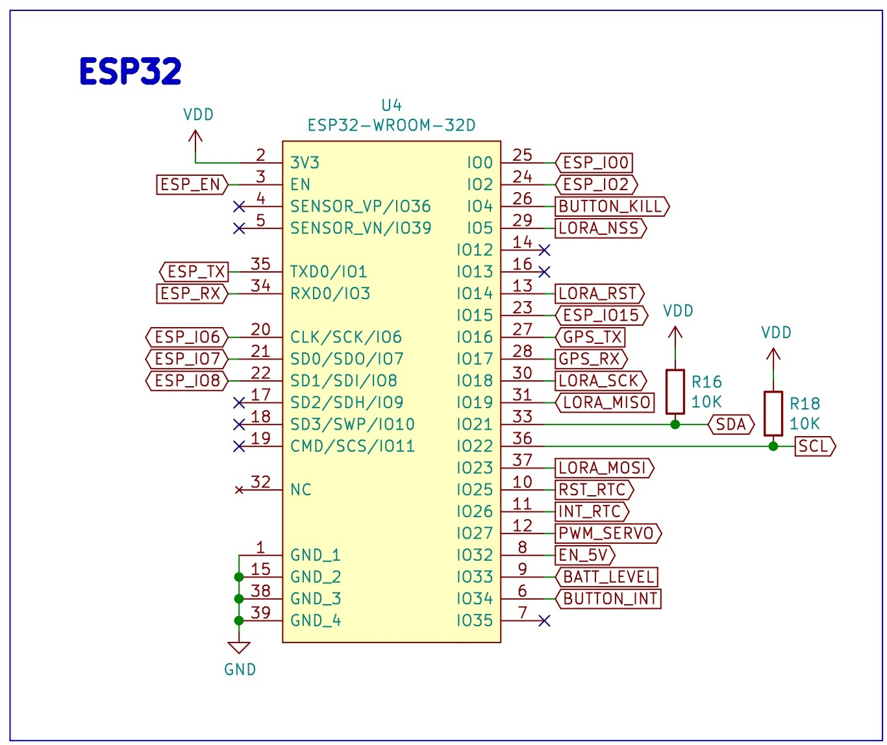

**[Back to top](#table-of-contents)**

### GPS

The selected GPS is the [ATGM332D-5N31](https://lcsc.com/product-detail/Satellite-Positioning-Modules_ZHONGKEWEI-ATGM332D-5N31_C128659.html), one the modules tested previously in our [Development Board for GPS Modules](https://hackaday.io/project/173457-2021-hdp-dream-team-eja/log/196269-gps-antenova-m20050-1-and-atgm332d-5n31-dev-board). The schematic is very simple, it has a decoupling capacitors (C2), a [U.FL connector](https://www.digikey.com/en/products/detail/hirose-electric-co-ltd/U-FL-R-SMT-1-10/2391570) for an external antenna (J4) and a [Coin Cell Battery Holder](https://www.digikey.com/en/products/detail/linx-technologies-inc/BAT-HLD-001-THM/3044009) (J2).

  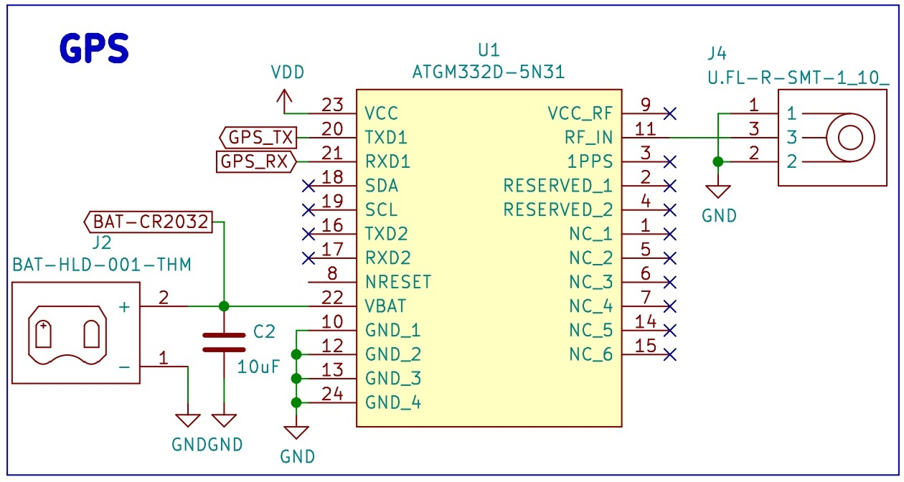

**[Back to top](#table-of-contents)**

### LoRa

The selected LoRa transceiver is the [RFM95W-915S2](https://www.digikey.com/en/products/detail/rf-solutions/RFM95W-915S2/6564923), the same module tested in our [Development Board for LoRa](https://hackaday.io/project/173457-2021-hdp-dream-team-eja/log/196116-lora-rfm95w-915s2-development-board). The schematic contains a [U.FL connector](https://www.digikey.com/en/products/detail/hirose-electric-co-ltd/U-FL-R-SMT-1-10/2391570) for an external antenna (J9).

  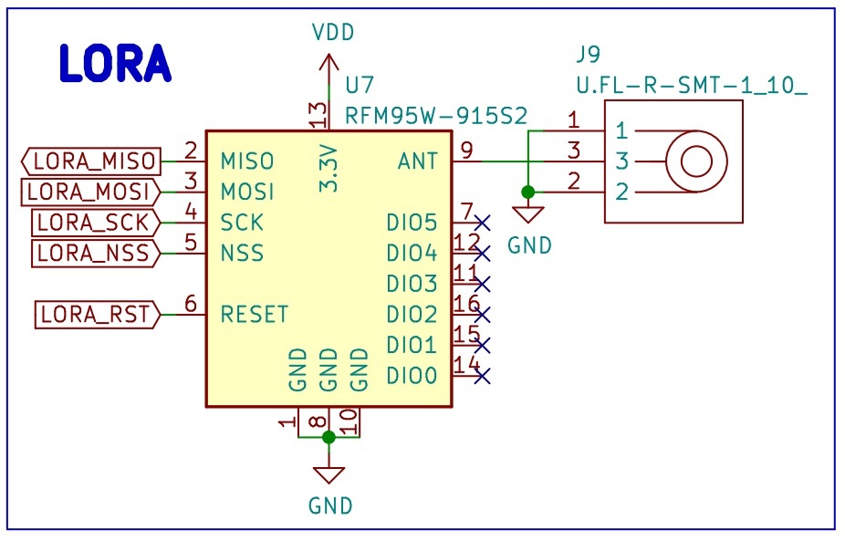

**[Back to top](#table-of-contents)**

### Real time Clock RTC

The design includes a dedicated RTC, the [DS3231M](https://www.digikey.com/en/products/detail/maxim-integrated/DS3231M-TRL/2402421?s=N4IgTCBcDaICIGUDMYkEYCyBqAKgJQBkBhHAWgDk4QBdAXyA).

  

**[Back to top](#table-of-contents)**

### Servo Motor Connector

There is a 1x3 header connector for a Servo Motor, the 5V for the servo is provided by a 5V 2A Stepup.

  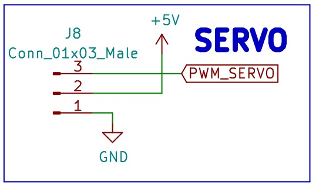

**[Back to top](#table-of-contents)**

### 5V 2A Stepup

The design includes the [TPS61030PWR](http://digikey.com/en/products/detail/texas-instruments/TPS61030PWPR/550685?s=N4IgTCBcDa4JwDYC0BGALGlyVIHIBEQBdAXyA), a boost converter with a 4A switch current, to provide the 5V for the Servo motor. The schematic contains the components for a 5V 2A output, following the design procedure that starts on the page 13 in the datasheet.

  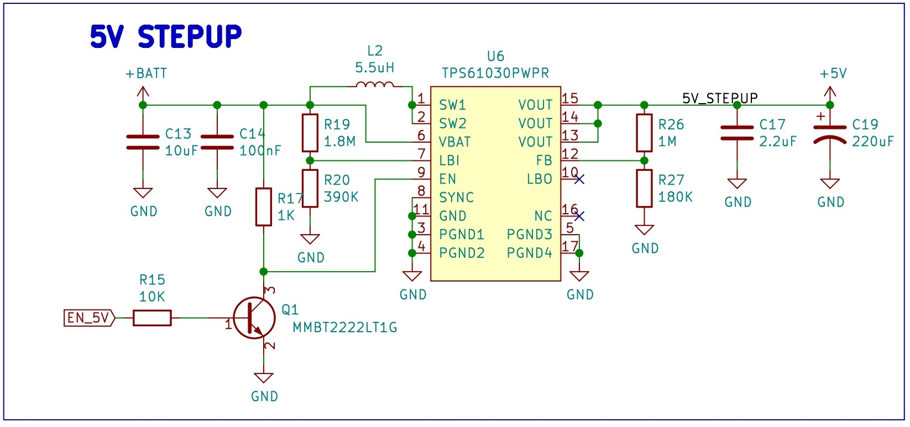

**[Back to top](#table-of-contents)**

### Accelerometer Connector

There is a connector for the [ADXL343 3 axis accelerometer](https://www.digikey.com/en/products/detail/adafruit-industries-llc/4097/9951931?s=N4IgTCBcDaIIwFYwA4C0KDsAWVA5AIiALoC%2BQA), a 1x9 header was used even though it only manages the signals VDD, GND, SCL and SDA, in case we want to use more connections for the accelerometer in future versions.

  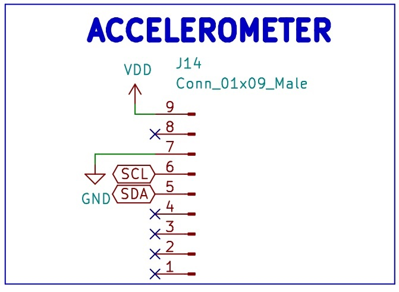

**[Back to top](#table-of-contents)**

### Battery Charging Circuit

To charge the 3.3V battery the design includes the [TP4056](https://www.lcsc.com/product-detail/Battery-Management-ICs_TPOWER-TP4056_C382139.html), a 1A Standalone Linear Li-lon Battery Charger. The schematic includes a green led to show the user that the battery is charged and a red led to show the user that the battery is charging. There is a [Battery Holder for a 18650 battery](https://www.digikey.com/en/products/detail/mpd-memory-protection-devices/BH-18650-PC/3029216?s=N4IgTCBcDaIEIAkC0BGAHANgKwAYkAUBhJAOQBEQBdAXyA) (J5) and an additional 1x2 header (J7) in case we want to use a different 3.3V battery.  There is also a 1x2 header (J3) to use a different type of connection for the charger (instead of the USB C), for example we can connect and test a QI Wireless Charger.

  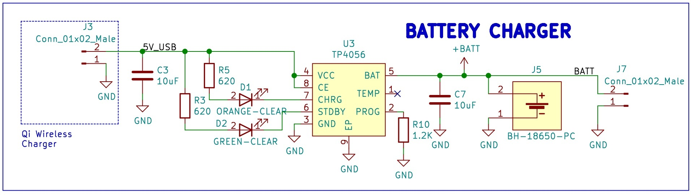

**[Back to top](#table-of-contents)**

### Battery Level

The design contains a circuit to measure a battery level, it is a simple resistor divider calculated for a range of 2.7V to 4.2V, the normal range for the 18650 Li-Ion Battery that will be used in the design.

  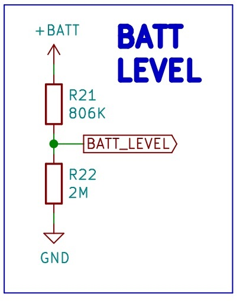

Those values for the resistor divider give the following range for the ADC:

- Maximum voltage: 4.2V * (2M / (0.806M + 2M)) = 2.99V
- Minimum voltage: 2.7V * (2M / (0.806M + 2M)) = 1.92V

That means that the ADC from the ESP32 will be reading analog values from 1.92V to 2.99V from the battery measurement circuit.

For more information about measuring lithium battery voltage visit the following [link](https://devzone.nordicsemi.com/nordic/nordic-blog/b/blog/posts/measuring-lithium-battery-voltage-with-nrf52).

**[Back to top](#table-of-contents)**

### 3V3 3A SEPIC Converter

Since the voltage of the battery can change from 2.7V (discharged) to 4.2V (charged), a SEPIC converter is included to provide a constant 3.3V to the digital circuits regardless of the changes in the input voltage from the battery. The selected SEPIC converter is the [LTC3113EFE#TRPBF](https://www.digikey.com/en/products/detail/analog-devices-inc/LTC3113EFE-TRPBF/2521714?s=N4IgTCBcDaIDIBUDCBmAjGlBRAYlgxAgEoAKAQjkggLQByAIiALoC%2BQA).

  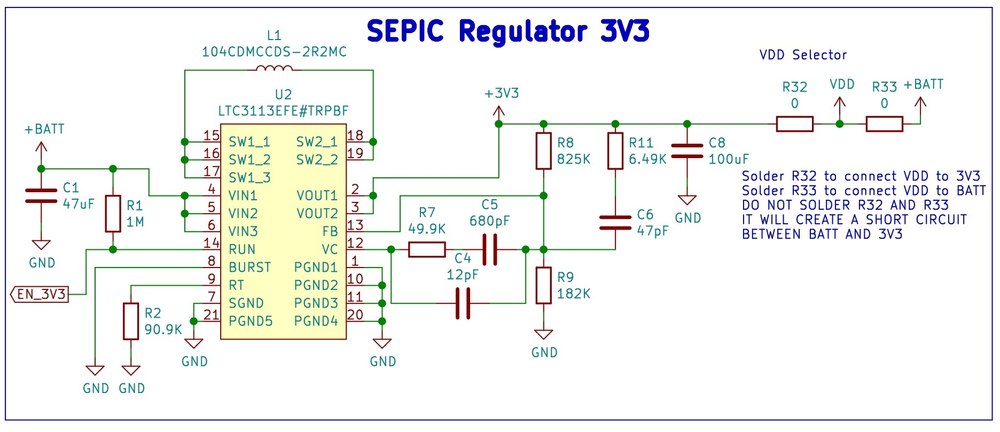

**Note**: The resistor R32 is a jumper that connects VDD to 3V3. R33 is a jumper that connects VDD to the battery. Do not solder both at the same time, it will create a short circuit between 3.3V from the SEPIC and the voltage from the battery. R32 and R33 are included just in case the SEPIC converter doesn't work and we have to connect the circuit directly to the battery.

**Summary: Do not solder R33**.

**[Back to top](#table-of-contents)**

### ON-OFF Led

There is  Green Led that turns on with the 3.3V from the SEPIC converter, it will notify the user/developer that the device is ON or OFF.

  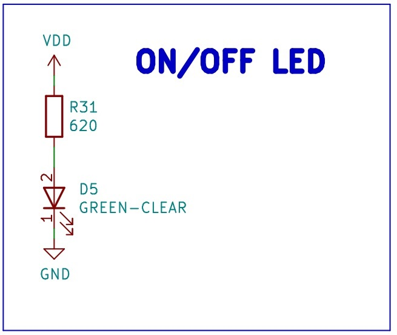

**[Back to top](#table-of-contents)**

### ON-OFF Button Circuit

The design contains a [LTC2954ITS8-1#TRPBF](https://www.digikey.com/en/products/detail/analog-devices-inc/LTC2954ITS8-1-TRPBF/1621452?s=N4IgTCBcDaIDIBUDCYCcBWALASQQZQA4BaARgGIEAlABQCEAxJBIgOQBEQBdAXyA), a pushbutton ON/OFF controller that manages the power supply (enables the 3.3V SEPIC) via a pushbutton interface.

  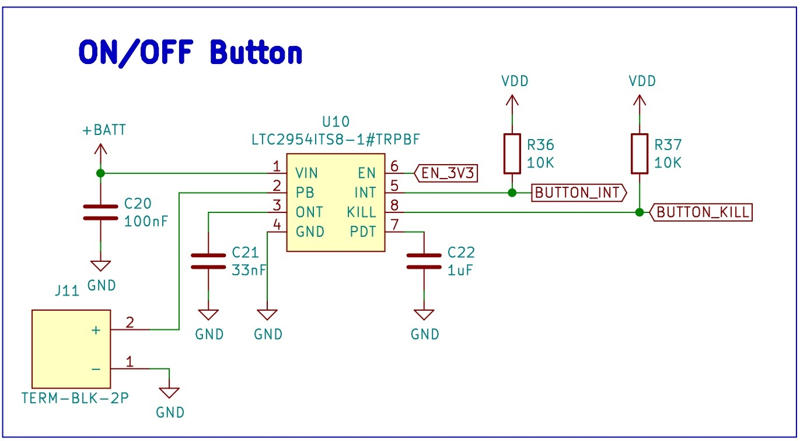

**[Back to top](#table-of-contents)**

### Extra Header

The design includes an 1x06 header to provide access for some of the unused pins in the ESP32.

  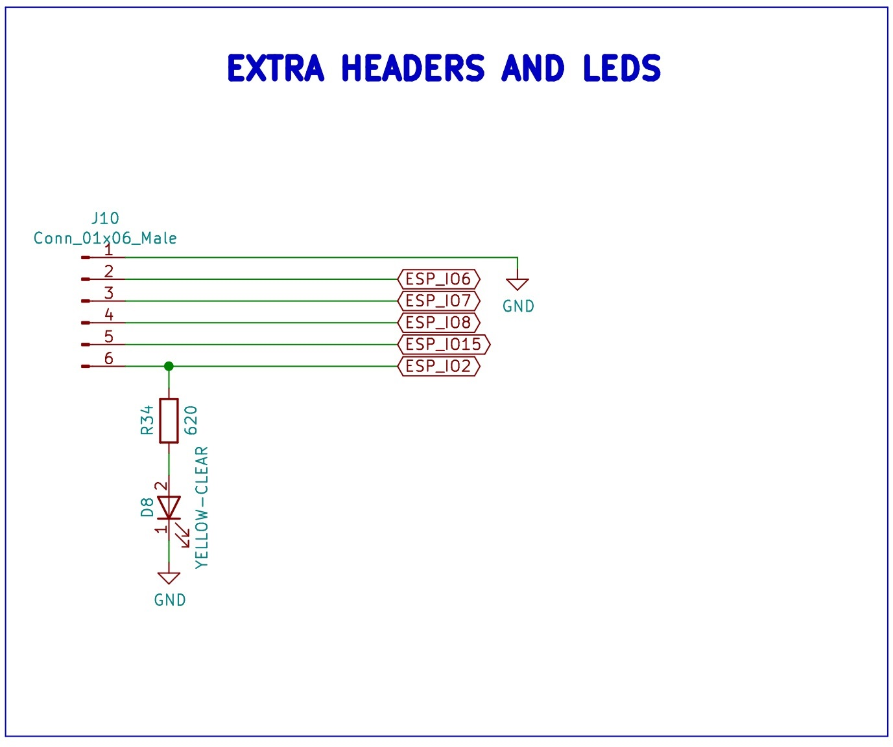

**[Back to top](#table-of-contents)**

## PCB Dimensions and Boundaries

The dimensions of the PCB are dictated by the maximum available space inside the buoy, from the enclosure design we where able to define the size of the PCB: 97.5 mm x 51.2 mm.

In the back layer there is a restricted region, that can't contain any components because the PCB is directly in contact with the enclosure in that region, those are the boundaries of the back layer. Through hole footprints where not be placed in that section, even if the footprint is placed in the front layer.

  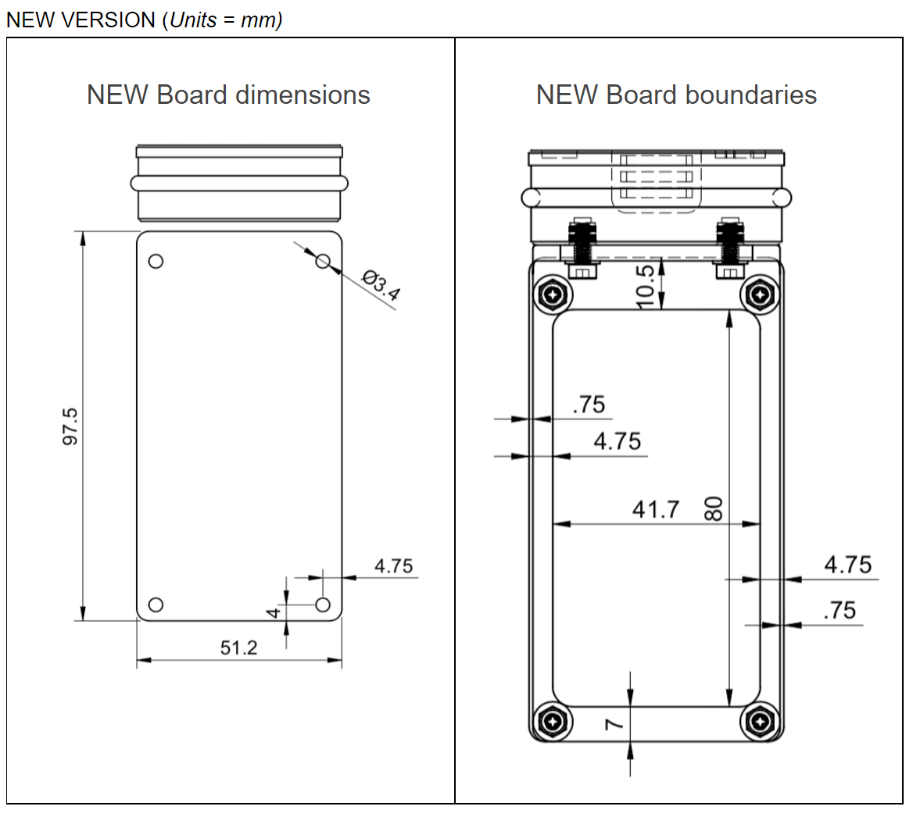

**[Back to top](#table-of-contents)**

## 3D Model

The following images show the front and back layers of the PCB.

  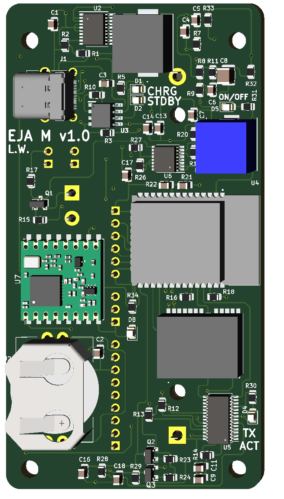

  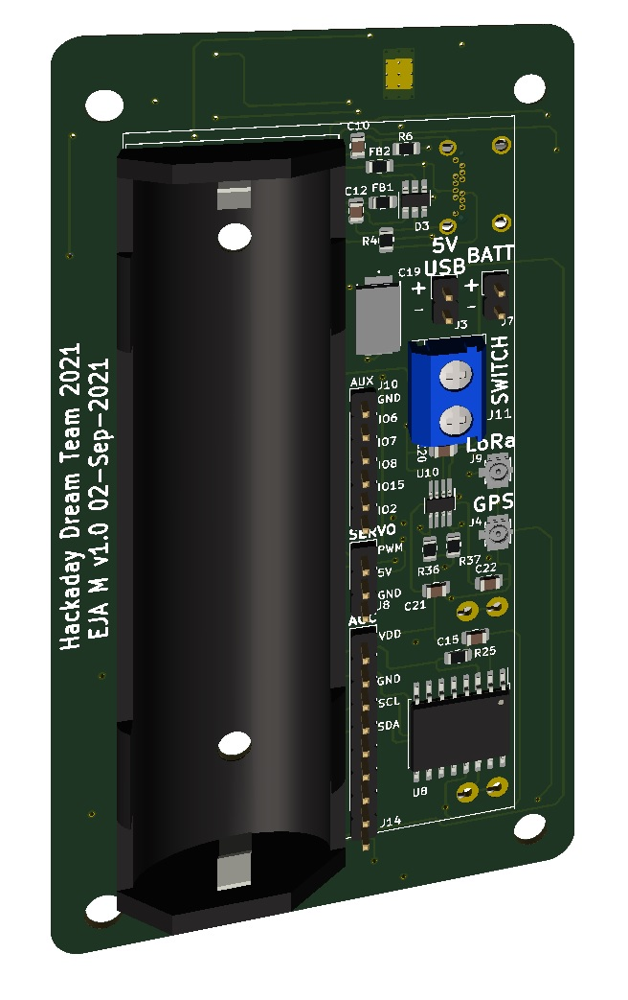

**[Back to top](#table-of-contents)**

## Bill of Materials

### PCB Components

| Reference | Quantity |
| ------------- | ------------- |
| [PCB](https://www.pcbway.com/)  | 1 |
| [47 µF ±20% 6.3V Ceramic Capacitor 0805](https://www.digikey.com/en/products/detail/taiyo-yuden/JMK212BBJ476MG-T/4970731)  | 1 |
| [10 µF ±10% 6.3V Ceramic Capacitor 0805](https://www.digikey.com/en/products/detail/samsung-electro-mechanics/CL21A106KQCLNNC/3888062)  | 4 |
| [12 pF ±5% 50V Ceramic Capacitor 0805](https://www.digikey.com/en/products/detail/stackpole-electronics-inc/CML0805C0G120JT50V/10660016)  | 1 |
| [680 pF ±10% 25V Ceramic Capacitor 0805](https://www.digikey.com/en/products/detail/w%C3%BCrth-elektronik/885012207059/5455614)  | 1 |
| [47 pF ±5% 16V Ceramic Capacitor 0805](https://www.digikey.com/en/products/detail/w%C3%BCrth-elektronik/885012007014/5453673)  | 3 |
| [100 µF ±20% 6.3V Ceramic Capacitor 1210](https://www.digikey.com/en/products/detail/murata-electronics/GRM32EE70J107ME15L/5027618)  | 1 |
| [0.1 µF ±10% 50V Ceramic Capacitor 0805](https://www.digikey.com/en/products/detail/avx-corporation/08055C104KAT2A/563505)  | 3 |
| [4.7 µF ±10% 6.3V Ceramic Capacitor 0805](https://www.digikey.com/en/products/detail/samsung-electro-mechanics/CL21A475KQFNNNE/3886856)  | 1 |
| [1 µF ±10% 16V Ceramic Capacitor 0805](https://www.digikey.com/en/products/detail/yageo/CC0805KKX7R7BB105/2103103)  | 4 |
| [2.2 µF ±10% 10V Ceramic Capacitor 0805](https://www.digikey.com/en/products/detail/samsung-electro-mechanics/CL21B225KPFNNNE/3886846)  | 1 |
| [220 µF Tantalum Capacitors 10V 2917](https://www.digikey.com/en/products/detail/nemco/PCT220-10HK/13236441)  | 1 |
| [0.033 µF ±10% 50V Ceramic Capacitor 0805](https://www.digikey.com/en/products/detail/w%C3%BCrth-elektronik/885012207095/5453932)  | 1 |
| [Orange 601nm LED - Discrete 2.1V 0805](https://www.digikey.com/en/products/detail/sunled/XZMOK54W-1/4745796)  | 1 |
| [Green 520nm LED - Discrete 3.2V 0805](https://www.digikey.com/en/products/detail/w%C3%BCrth-elektronik/150080GS75000/4489915)  | 2 |
| [TVS Diode 15V Clamp 5A (8/20µs) SOT-23-6](https://www.digikey.com/en/products/detail/comchip-technology/CPDT6-5V4-HF/1121118)  | 1 |
| [Red 630nm LED - Discrete 1.9V 0805](https://www.digikey.com/en/products/detail/w%C3%BCrth-elektronik/150080SS75000/4489921)  | 1 |
| [Yellow 590nm LED - Discrete 2V 0805](https://www.digikey.com/en/products/detail/everlight-electronics-co-ltd/QTLP630C3TR/2675901)  | 1 |
| [1 Signal Line Ferrite Bead 0805 300mA 350mOhm](https://www.digikey.com/en/products/detail/fair-rite-products-corp/2508056017Y0/8594301)  | 2 |
| [USB-C USB 3.2 Gen 2 Receptacle Connector](https://www.digikey.com/en/products/detail/cui-devices/UJ31-CH-G2-SMT-TR/8024057)  | 1 |
| [Battery Retainer Coin, 20.0mm 1 Cell PC Pin](https://www.digikey.com/en/products/detail/linx-technologies-inc/BAT-HLD-001-THM/3044009)  | 1 |
| [U.FL (UMCC) Connector Receptacle](https://www.digikey.com/en/products/detail/hirose-electric-co-ltd/U-FL-R-SMT-1-10/2391570)  | 2 |
| [Battery Holder (Open) 18650 1 Cell PC Pin](https://www.digikey.com/en/products/detail/mpd-memory-protection-devices/BH-18650-PC/3029216)  | 1 |
| [2 Position Terminal Block Horizontal](https://www.digikey.com/en/products/detail/on-shore-technology-inc/OSTTC022162/614558)  | 1 |
| [2.2 µH Inductor 15 A 7mOhm Max](https://www.digikey.com/en/products/detail/sumida-america-components-inc/104CDMCCDS-2R2MC/5812436)  | 1 |
| [5.5 µH Inductor 10 A 10.3mOhm](https://www.digikey.com/en/products/detail/w%C3%BCrth-elektronik/744325550/1638576)  | 1 |
| [Bipolar (BJT) Transistor NPN 30V 600mA SOT-23-3](https://www.digikey.com/en/products/detail/onsemi/MMBT2222LT1G/919595)  | 3 |
| [1 MOhms ±1% 0.125W Chip Resistor 0805](https://www.digikey.com/en/products/detail/stackpole-electronics-inc/RMCF0805FT1M00/1760080)  | 2 |
| [90.9 kOhms ±1% 0.125W Chip Resistor 0805](https://www.digikey.com/en/products/detail/stackpole-electronics-inc/RMCF0805FT90K9/1760265)  | 1 |
| [620 Ohms ±5% 0.125W Chip Resistor 0805](https://www.digikey.com/en/products/detail/yageo/RC0805JR-07620RL/728357)  | 5 |
| [5.1 KOhms ±1% 0.125W Chip Resistor 0805](https://www.digikey.com/en/products/detail/stackpole-electronics-inc/RMCF0805FT5K10/1760394)  | 3 |
| [49.9 KOhms ±1% 0.125W Chip Resistor 0805](https://www.digikey.com/en/products/detail/stackpole-electronics-inc/RMCF0805FT49K9/1760272)  | 1 |
| [825 kOhms ±0.5% 0.125W Chip Resistor 0805](https://www.digikey.com/en/products/detail/panasonic-electronic-components/ERA-6AED8253V/3481309)  | 1 |
| [182 kOhms ±1% 0.25W Chip Resistor 0805](https://www.digikey.com/en/products/detail/koa-speer-electronics-inc/RK73H2ATTD1823F/10234151)  | 1 |
| [1.2 kOhms ±5% 0.125W Chip Resistor 0805](https://www.digikey.com/en/products/detail/yageo/RC0805JR-071K2L/728224)  | 1 |
| [6.49 kOhms ±1% 0.125W Chip Resistor 0805](https://www.digikey.com/en/products/detail/panasonic-electronic-components/ERJ-6ENF6491V/111437)  | 1 |
| [27 Ohms ±1% 0.125W Chip Resistor 0805](https://www.digikey.com/en/products/detail/stackpole-electronics-inc/RMCF0805FT27R0/1712920)  | 2 |
| [10 kOhms ±1% 0.125W Chip Resistor 0805](https://www.digikey.com/en/products/detail/vishay-dale/CRCW080510K0FKEAC/7928398)  | 10 |
| [1 kOhms ±1% 0.125W Chip Resistor 0805](https://www.digikey.com/en/products/detail/stackpole-electronics-inc/RMCF0805FT1K00/1760090)  | 1 |
| [1.8 MOhms ±1% 0.125W Chip Resistor 0805](https://www.digikey.com/en/products/detail/panasonic-electronic-components/ERJ-6ENF1804V/282715)  | 1 |
| [390 kOhms ±1% 0.125W Chip Resistor 0805](https://www.digikey.com/en/products/detail/yageo/RC0805FR-07390KL/727903)  | 1 |
| [806 kOhms ±1% 0.125W Chip Resistor 0805](https://www.digikey.com/en/products/detail/panasonic-electronic-components/ERJ-6ENF8063V/112197)  | 1 |
| [2 MOhms ±1% 0.125W Chip Resistor 0805](https://www.digikey.com/en/products/detail/vishay-dale/CRCW08052M00FKECC/7928551)  | 1 |
| [180 kOhms ±0.5% 0.1W Chip Resistor 0805](https://www.digikey.com/en/products/detail/susumu/RR1220P-184-D/432345)  | 1 |
| [0 Ohms Jumper 0.125W Chip Resistor 0805](https://www.digikey.com/en/products/detail/yageo/RC0805JR-070RL/728216)  | 2 |
| [ATGM332D-5N31 GNSS Series GPS+BDS 12.2x16x2.4mm](https://www.lcsc.com/product-detail/Satellite-Positioning-Modules_ZHONGKEWEI-ATGM332D-5N31_C128659.html)  | 1 |
| [Buck-Boost Switching Regulator 1.8V 1 Output 3A](https://www.digikey.com/en/products/detail/analog-devices-inc/LTC3113EFE-TRPBF/2521714)  | 1 |
| [TP4056 ESOP-8 Battery Management](https://www.lcsc.com/product-detail/Battery-Management-ICs_TPOWER-TP4056_C382139.html)  | 1 |
| [ESP32-WROOM-32D (4MB)](https://www.digikey.com/en/products/detail/espressif-systems/ESP32-WROOM-32D-4MB/9381716)  | 1 |
| [FTDI USB Bridge, USB to I²C/UART USB 2.0 I²C, UART Interface 28-TSSOP](https://www.digikey.com/en/products/detail/ftdi-future-technology-devices-international-ltd/FT260S-U/6124909)  | 1 |
| [TPS61030PWPR Boost Switching Regulator IC Positive Adjustable 1.8V 1 Output 3.6A (Switch)](https://www.digikey.com/en/products/detail/texas-instruments/TPS61030PWPR/550685)  | 1 |
| [RFM95W-915S2-ND LoRa Transceiver Module 915MHz](https://www.digikey.com/en/products/detail/rf-solutions/RFM95W-915S2/6564923)  | 1 |
| [DS3231M+TRL Real Time Clock I²C, 2-Wire Serial](https://www.digikey.com/en/products/detail/maxim-integrated/DS3231M-TRL/2402421)  | 1 |
| [Power Supply On/Off Controller Push Button](https://www.digikey.com/en/products/detail/analog-devices-inc/LTC2954ITS8-1-TRPBF/1621452)  | 1 |
| [Connector Header Through Hole 40 position (2.54mm)](https://www.digikey.com/en/products/detail/sullins-connector-solutions/PREC040SFAN-RC/2774934)  | 1 |

### Externals Components

| Reference | Quantity |
| ------------- | ------------- |
| [SERVOMOTOR RC 5V HIGH TORQUE](https://www.digikey.com/products/es?keywords=1528-1084-ND)  | 1 |
| [CR2032 Lithium Coin Cell Battery](https://www.adafruit.com/product/654)  | 1 |
| [18650 Lithium-Ion 3.7V Battery Rechargeable 3.4Ah](https://www.digikey.com/en/products/detail/ultralast/LION-1865-34/13692714)  | 1 |
| [ADXL343 - Triple-Axis Accelerometer](https://www.digikey.com/en/products/detail/adafruit-industries-llc/4097/9951931)  | 1 |

For more information about the BOM including prices and different comparisons with my previous designs visit the following [link](https://hackaday.io/project/173457-2021-hdp-dream-team-eja/log/198071-eja-m-v10-bill-of-materials).

**[Back to top](#table-of-contents)**
